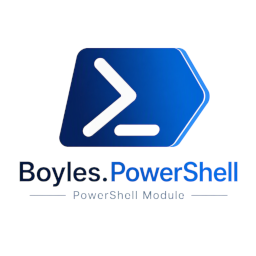

# Boyles.PowerShell



A multi-module PowerShell family, structured the way `Az` and `Microsoft.Graph`
are: one umbrella module, one shared `Boyles.PowerShell.Core` module, and one
module per service - each service module pairs a thin PowerShell layer with a
C# class library that owns HTTP/auth concerns.

**This repo is under active scaffolding.** The layout below reflects what
actually exists today.

| Module                   | Purpose                                                                                                                                                 |
| ------------------------ | ------------------------------------------------------------------------------------------------------------------------------------------------------- |
| `Boyles.PowerShell`      | Umbrella/meta-module. No cmdlets of its own - importing it imports every module below via `RequiredModules`.                                            |
| `Boyles.PowerShell.Core` | Shared authentication, HTTP transport, retry/pagination/JSON pipeline, diagnostics, and the client context cache. Every service module depends on this. |
| `Boyles.PowerShell.Hudu` | Service module for [Hudu](https://www.hudu.com/), backed by a `HuduClient` C# library.                                                                  |

## How the pieces connect

- **`Boyles.PowerShell.Core`** owns authentication (`Authentication/`), HTTP
  transport (`Http/HttpTransport.cs`, a shared `SocketsHttpHandler` /
  `HttpClientHandler` so sockets pool across all client instances), the
  retry/pagination/JSON pipeline (`HttpClients/HttpClientBase.cs`),
  diagnostics (`Diagnostics/` - `IHttpDiagnosticsSink` +
  `HttpCallRecordBuilder` build redacted request/response records per HTTP
  attempt), exceptions (`Exceptions/ApiException.cs`), and the client state
  store (`Context/ContextCache.cs`).
- **`Context/ContextCache.cs`** is a static, thread-safe
  `ConcurrentDictionary<string, object>` mapping a caller-chosen key to a
  connected service client (e.g. a `HuduClient`) - the same shape as `Az`'s
  default-context cache. A service module's `Connect-*` cmdlet builds its
  client and registers it under a key; every other cmdlet in that module
  looks the client back up by the same key instead of needing it passed to
  every call. Re-registering a key disposes the previous client first if
  it's `IDisposable`, so re-running `Connect-*` doesn't leak sockets.
  Wrapped for PowerShell by `Add-BPSClient`, `Get-BPSClient`,
  `Test-BPSClient`, `Remove-BPSClient`, and `Get-BPSClientKey`
  (`Module/Public/Context/` in Core) - these are generic across services;
  they don't know or care what type of client they're holding. See
  `Connect-Hudu.ps1` for the end-to-end pattern a new service module should
  follow.
- **Service modules** (e.g. `Boyles.PowerShell.Hudu`) each pair a `Module/`
  folder with a sibling C# project referencing Core. A service's C# client
  (e.g. `Services/HuduClient.cs`) derives from `HttpClientBase` so cmdlets
  stay thin wrappers around it.
- **Module loading pattern**: every module's `.psm1` registers an
  `AssemblyResolve` handler pointed at its own `Module\bin` folder before
  `Add-Type`-ing its own compiled assembly, so dependency DLLs (e.g.
  `Newtonsoft.Json.dll`) resolve correctly under both Windows PowerShell 5.1
  and PowerShell 7+. It then dot-sources every `.ps1` found _recursively_
  under `Public/` and `Private/` and exports only the `Public` function
  names. `tools/New-Submodule.ps1` generates this same boilerplate for new
  modules.
- Service module manifests declare
  `RequiredModules = @('Boyles.PowerShell.Core')`, so importing a service
  module (or the umbrella) always pulls Core in first.
- Every C# project targets `netstandard2.0` (so one binary loads under both
  PS 5.1 and PS 7+), copies NuGet deps into `bin/` via
  `CopyLocalLockFileAssemblies=true` (set in `Directory.Build.props`), and
  has a `CopyToPowerShellModule` post-build target that stages the built
  DLLs into its own `Module\bin\` folder.

## Commands

```powershell
./build.ps1                      # runs psake (see Known drift - this does not currently compile anything)
./build.ps1 -Bootstrap           # installs PSDepend + the modules in requirements.psd1, then Invoke-PSDepend
./build.ps1 -Task <TaskName>     # run a specific psake task from psakefile.ps1 (default task is 'Init')
./build.ps1 -Clean               # intended to wipe out/, bin/, obj/ first (currently a no-op)

dotnet build Boyles.PowerShell.slnx     # actually compiles the C# projects (Core, Hudu, Common)
dotnet test                             # run the xUnit test suites under test/*.Tests/
Invoke-Pester ./test/Pester             # run the Pester suites - requires a populated ./out first
```

```powershell
Invoke-ScriptAnalyzer -Path . -Recurse -Settings ./PSScriptAnalyzerSettings.psd1
```

## Adding a new service module

```powershell
./tools/New-Submodule.ps1 -ServiceName ITGlue
```

This scaffolds `src/Boyles.PowerShell.ITGlue/...` in the same shape as
`src/Boyles.PowerShell.Hudu`, adds the new `.csproj` to
`Boyles.PowerShell.slnx`, and references `Boyles.PowerShell.Core`. It does
**not** add the module to the umbrella - once it's ready to ship, list it by
hand in `src/Boyles.PowerShell/Boyles.PowerShell.psd1`'s `RequiredModules`,
the same way each `Az.*` module is added to `Az.psd1` deliberately.

## Architecture

- **Umbrella module** (`src/Boyles.PowerShell/`): manifest-only, no C# and no
  cmdlets of its own. Its `.psd1` lists every service module in
  `RequiredModules`; importing it just pulls in Core plus every service
  module.
- **C# source layout mirrors the target namespace as literal folders** in
  Core, e.g. `src/Boyles.PowerShell.Core/Boyles/PowerShell/Authentication/*.cs`
  for namespace `Boyles.PowerShell.Authentication`
  (`Boyles.PowerShell.Core.csproj` sets `RootNamespace` to empty specifically
  so this works). Service module projects (Hudu, Common) instead set
  `RootNamespace` to their own module name and use normal folders
  (`Services/`, `Models/`).
- `Directory.Build.props` supplies shared Authors/Company/LangVersion/Nullable
  settings to every `.csproj` in the repo.
